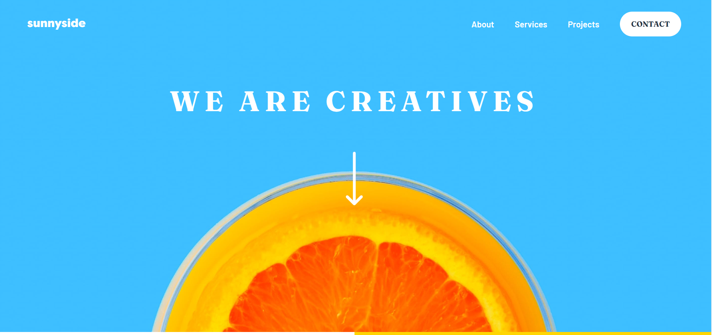
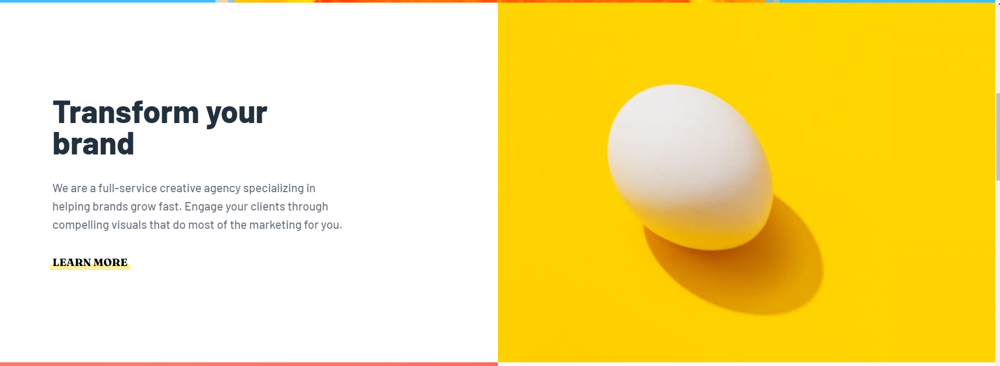
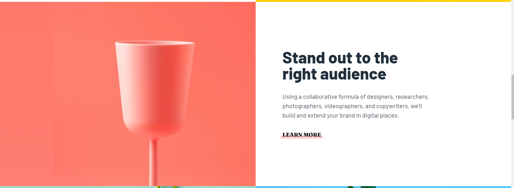
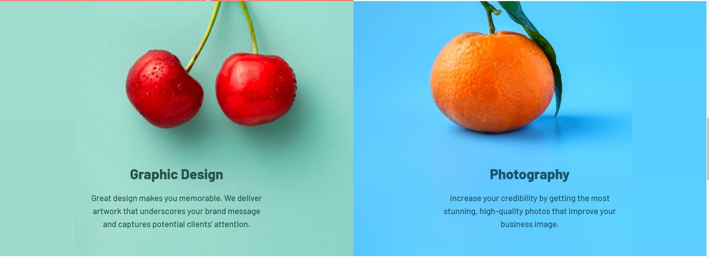
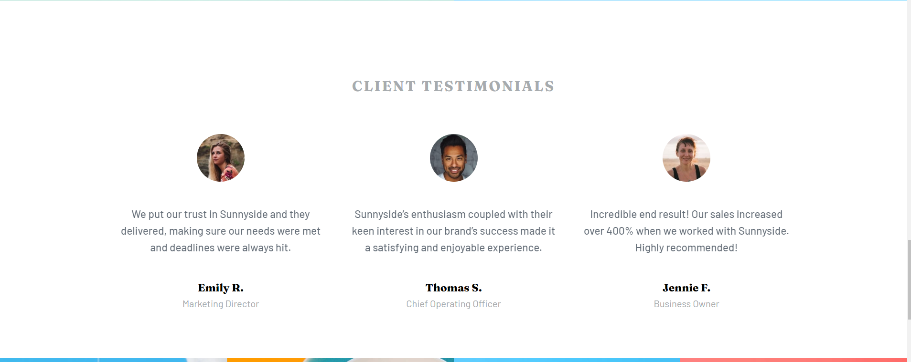
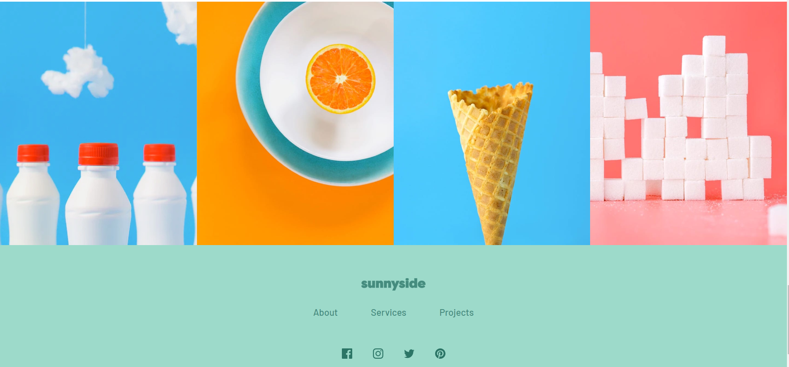
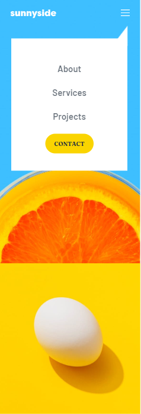
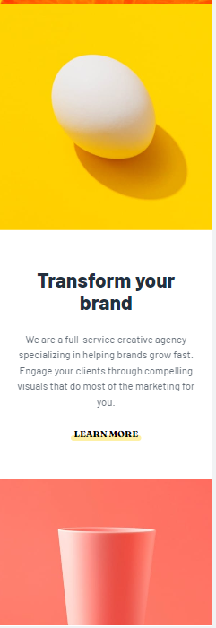
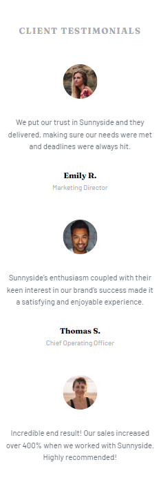
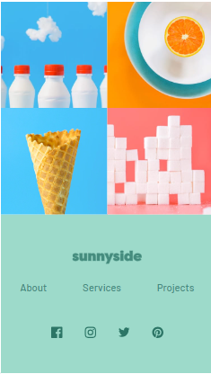

# Sunnyside agency landing page

## Table of contents

- [Overview](#overview)
  - [The challenge](#the-challenge)
  - [Screenshot](#screenshot)
  - [Links](#links)
- [My process](#my-process)
  - [Built with](#built-with)
  - [What I learned](#what-i-learned)
- [Author](#author)

## Overview

### The challenge

Users should be able to:

- View the optimal layout for the site depending on their device's screen size
- See hover states for all interactive elements on the page

### Screenshot

### Links

- Solution URL: [My GitHub Solution](https://github.com/Manufacturer1/sunnyside-agency-landing-page)
- Live Site URL: [Website](https://sunnyside-agency-landing-page-six-chi.vercel.app/)

## My process

### Built with

- Semantic HTML5 markup
- CSS custom properties
- Flexbox
- CSS Grid
- Mobile-first workflow
- [React](https://reactjs.org/) - JS library
- [TailwindCSS](https://v2.tailwindcss.com/) - CSS framework

### What I learned

I learned a lot about css image positioning and responsive design

## Author

- Website - [My GitHub](https://github.com/Manufacturer1)
